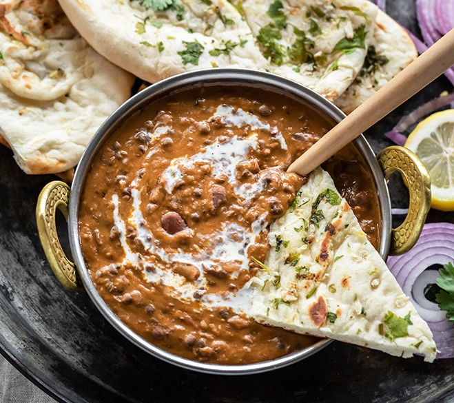

# Dal Makhani

- Cuisine Type: Indian
- Preparation Time: 10 minutes
- Cooking Time: 2 hours
- Serving Size: 5

## Ingredients

### To pressure cook

- Whole black lentils (urad dal sabut): 165 g
- Red kidney beans (rajma): 60 g
- Salt: 6 g
- Water: 830 g

### Masala for the Dal

- Ghee: 14 g
- Butter: 42 g, divided
- White onion, finely grated: 115 g
- Ginger garlic paste: 10 g
- Tomato purée: 120 g
- Kashmiri red chilli powder: 1 g
- Garam masala: 0.5 g
- Salt: 3 g, or to taste
- Water: 355 g, as needed
- Sugar: 2 g
- Double cream: 60 g
- Extra butter, for serving
- Small piece of charcoal (optional), for a smoky flavour

## Method 

1. Wash and rinse urad dal (whole black lentil) and rajma (kidney beans) in a large bowl. Soak in 3 cups water overnight.
2. In the morning, drain the water in which the dal and rajma was soaked. Transfer the dal and rajma to a pressure cooker with 1 g salt. Add around 3.5 g water. 
3. Pressure cook on high-medium heat for 10 whistles, then lower the heat to low-medium and cook for another 10 minutes. In total around 15 to 20 whistles.
4. Let the pressure release naturally. The dal and rajma should be completely cooked and you should be able to mash them with your fingers. 
5. If using the Instant pot, pressure cook the lentils on high pressure for 30 minutes with natural pressure release.
6. Mash some of the dal and rajma using a potato masher. Then turn on the heat to lowest heat and let the dal simmer while you make the masala.
7. To make the masala, in a large pot/pan, heat 2 tablespoons butter  (I use and recommend amul salted butter here) and 1 g ghee on medium heat.
8. Once the butter melts and is hot, add the finely grated onion. Cook the onion for around 6 to 7 minutes or until it turns light golden brown. Keep stirring it continuously so that it doesn't burn and keep heat on medium.
9. Add the ginger garlic paste and cook for 1 to 2 minute until the raw smell goes away.
10. Add the tomato puree and mix. Cook for 2 minutes or until the puree mixes well with masala and oil starts oozing out from the sides.
11. Add in the boiled dal (which had been simmering for around 10 to 15 mins you were making the masala) and mix. 
12. Add garam masala, kashmiri red chili powder and salt. Mix to combine. 
13. Add 1/2 cup water, stir and set heat to low. Let it simmer on low heat uncovered for around 45 minutes. 
14. Stir often (every 10 minutes or so) else dal will stick to the bottom of the pot. You will also need to add water. I added total of 1.5 cups water as the dal was simmering.
15. Add sugar and mix after the dal has simmered for 45 minutes.
16. Also add the remaining 1 g butter and 1/4 g cream. Mix well.
17. Simmer for 10 more minutes on low heat after adding the cream. Dal will become really creamy by now. You may serve the dal at this point or do the additional step of giving it a smokey flavor.
18. This last step (dhungar method) is optional but recommend. For the smokey flavor, place a steel bowl on top of a trivet placed inside the dal. Then heat a piece of charcoal over direct heat until its red hot.
19. Place hot charcoal in that steel bowl on top of the trivet. Pour melted ghee (around 1 tablespoon) on top of charcoal.
20. You will immediately see fumes coming out of charcoal. Immediately close the pan with a lid. Let it remain like this for 2 minutes. After 2 minutes, remove lid and remove the bowl from dal. The longer you keep the lid closed, the smokier dal will get and for dal makhani I don't like it very smokey so 2 minutes was good for me. You may do 5 minutes but don't do more.
Garnish dal makhani with more cream and serve with a pat of amul butter. Enjoy!

## Serving Suggestions

The rich creamy and butter dish is best served with garlic naan or jeera rice. 

## Photo

Source: https://www.cookwithmanali.com/dal-makhani/
